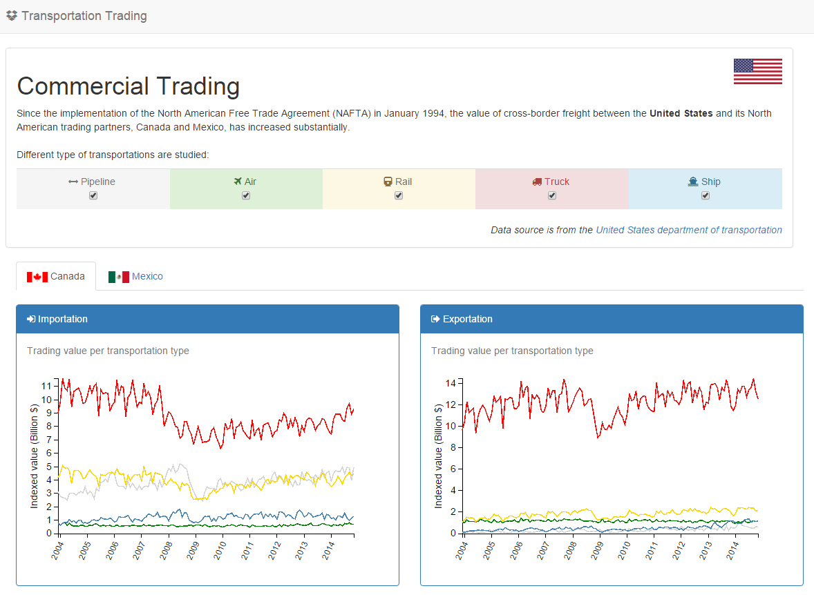

[](http://transportation-trading.herokuapp.com)


# US Transportation Trading

> Application to visualize US export/import data based on transportation type

Source used: [catalog.data.gov/dataset/the-north-american-transborder-freight-database](https://catalog.data.gov/dataset/the-north-american-transborder-freight-database)

CSV data are manually downloaded and stored in [dataset](dataset) folder. Then there are processed using a script [process_raw.sh](dataset/process_raw.sh) to get a json format.

Demo
-----

Hosted demo is available on heroku at [transportation-trading.herokuapp.com](http://transportation-trading.herokuapp.com/)

Quick Start
-----

```sh
$ npm install
$ node_modules/.bin/bower install
$ npm start
```

Technologies used
-----

* Node 
* Express 
* D3 
* JQuery 
* Twitter Bootstrap 
